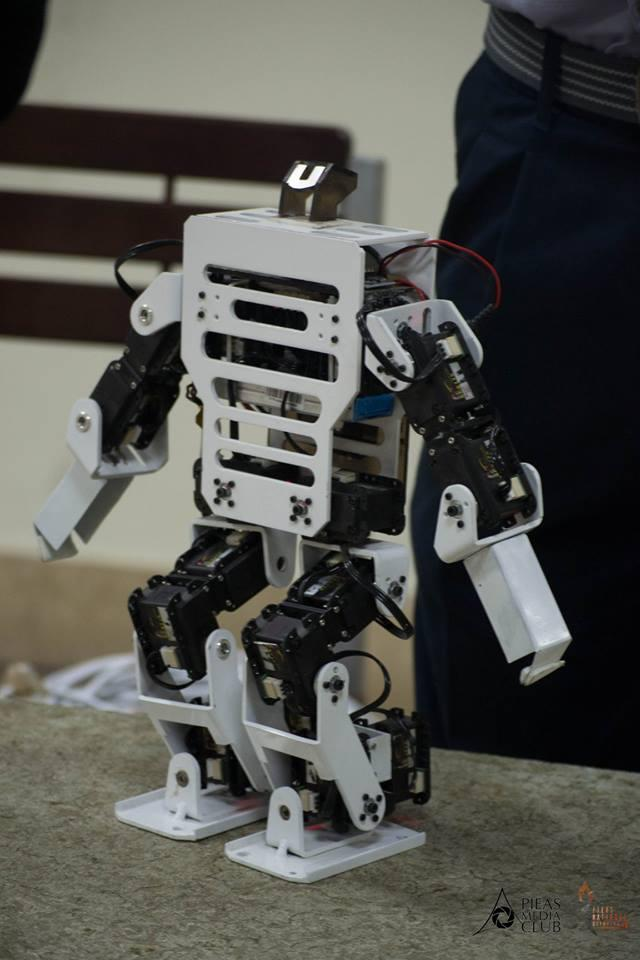

# [Project 1: Humanoid Robot](https://youtube.com/shorts/sz7JJU25oyM)
* Created a Humanoid robot as final year venture.
* This is an Arduino/ESP32 based robot used to host international humanoid football matches.
* Engineered features from the text of each job description to quantify the value companies put on python, excel, aws, and spark. 
* Optimized Linear, Lasso, and Random Forest Regressors using GridsearchCV to reach the best model. 
* Built a client facing API using flask 

# Project 2: Brain Tumor Detection
* Created a tool that estimates data science salaries (MAE ~ $ 11K) to help data scientists negotiate their income when they get a job.
* Scraped over 1000 job descriptions from glassdoor using python and selenium
* Engineered features from the text of each job description to quantify the value companies put on python, excel, aws, and spark. 
* Optimized Linear, Lasso, and Random Forest Regressors using GridsearchCV to reach the best model. 
* Built a client facing API using flask 
